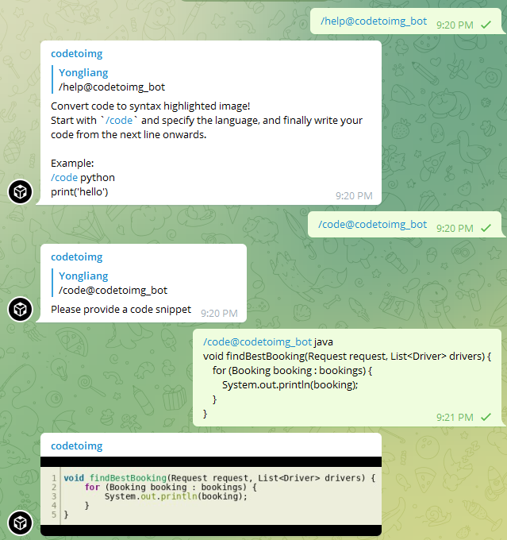

  

## codetoimg
A Simple Code To Image Telegram Bot

## Usage
- Go to Telegram and chat with @codetoimg_bot
- Or, add @codetoimg_bot to your Telegram group

## Demo

## Functions
- `/help` - See what the bot does!
- `/code` - Convert code to image!

## Flow
1. The bot is deployed in the cloud and will be available after a command is issued to it.
2. Users either direct chat or add the bot into a Telegram group to interact with it.
3. The bot will respond to the code command and send a syntax highlighted image of the code.

## How we built it
We built this app with a python backend and hosted it on Heroku

## Development
1. git clone the repository (either via GitHub desktop or CLI)
2. change to project directory
 - `cd codetoimg_bot` 
3. create virtual environment
 - `python3 -m venv venv # If not created, creating virtualenv`
4. activate virtual environment
 - Windows: `venv\Scripts\activate.bat`
 - Mac: `source ./venv/bin/activate # Activating virtualenv`
 - (Better) using VSCode, select the python interpreter within the `venv` folder and the above is done automatically
5. install dependencies
 - `pip3 install -r ./requirements.txt # Installing dependencies`
6. to update requirements after adding or removing dependencies
 - `pip freeze > requirements.txt`
## Commands
- To re-deploy: `git push heroku main` (For the one with the hosting account)
- To start the bot locally: `python bot.py`
## Reference
- [Deployment](https://towardsdatascience.com/how-to-deploy-a-telegram-bot-using-heroku-for-free-9436f89575d2)
- [python-telegram-bot on Heroku](https://github.com/Bibo-Joshi/ptb-heroku-skeleton)

